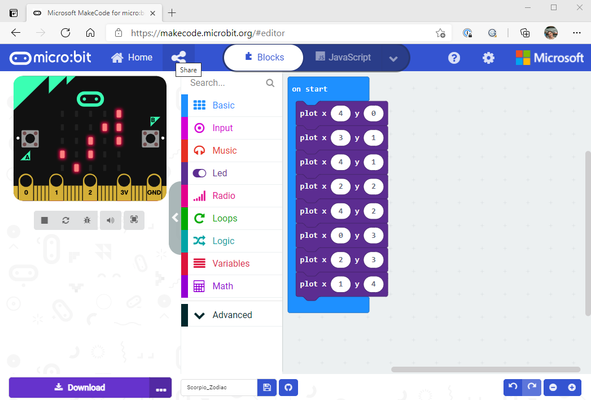
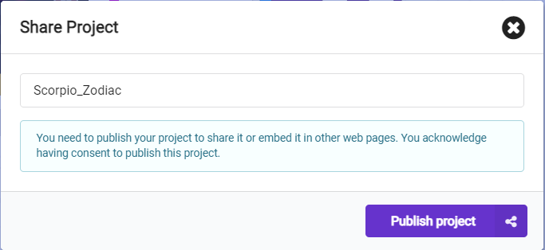
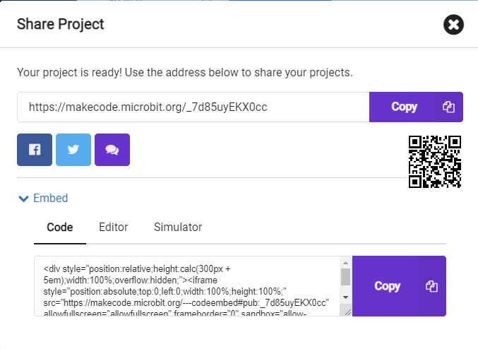
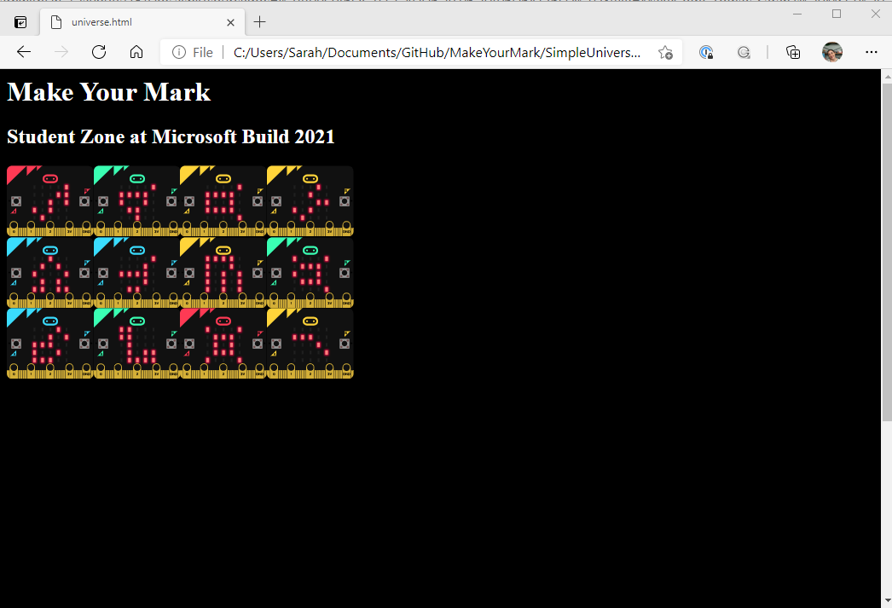

# Make Your Mark at the Student Zone 2021

Taking part in the Student Zone at Microsoft Build is about so much more than just learning about tools and resources -- it's also about joining a community of other developers and collaborating to produce something amazing! 

To give you the opportunity to show you were there, we've made this stellar MakeCode and JavaScript community project and invite you to make your mark on our Student Zone universe!

This inspired the session [Make your mark: contribute to a community project using MakeCode and JavaScript ](https://mybuild.microsoft.com/sessions/9ff3107b-0895-4d3a-a585-09ee14d2d05c?source=sessions) at Microsoft Build with Chloe Condon and Morgan Bell!

# Make YOUR Mark!

To get started:
1. Go to the [MakeCode on micro:bit](https://makecode.microbit.org/) coding page.
2. Create a simple constellation using the 5x5 grid of LEDs
3. Share it [here](https://guthals.com/MakeYourMark/)!
4. Need some inspiration? Check out the 12 constellations that we made [here](constellations.md)

Want to get invovled more? Keep reading!

# MakeCode and the Web Dev Universe

When trying to think of a way for all of us to show we're a part of this incredible learning community, I wanted to find a way where learners of all skill levels and ages could participate. So, I decided to mix together [MakeCode](https://makecode.com/) and Web Dev to create a "universe" webpage that pulled in MakeCode projects. 

## What is MakeCode

MakeCode is an incredible, free, browser-based learning portal for anyone to get started learning to code with a block-based language, JavaScript, or Python. MakeCode brings learners on a journey through writing code for Minecraft, LEGO Mindstorms, the Circuit Playground Express, The Arcade, the Cue, the Chibi Chip, and the micro:bit. 

### MakeCode and micro:bit

This project will be using the [micro:bit MakeCode integration](https://makecode.microbit.org/) because it offers up the simplest way to show off "stars". The micro:bit is a simple square device with 25 LEDs on a 5x5 grid, 2 buttons, 3 pins plus 1 ground and 1 3v. The best part? **you do not have to have the physical device in order to try it out!** There is a simulator right on the MakeCode coding page!

And that simulator is exactly what we're using to create our universe!

### Embedding the micro:bit Simulator

To make this easy, MakeCode and micro:bit have an incredible embeddable simulator!

When you create a project, you can share that project publicly *and* embed the code, the editor, or the simulator into a simple webpage!

How to embed:
1. Create a micro:bit MakeCode project
2. Click the Share button  

4. Click the Publish button  

6. Click the embed expansion  

8. Copy the HTML code to embed:
  a. The Code
  b. The Editor
  c. The Simulator

For example, I made a simple Scorpio Zodiac, here are all the ways I can share it:

#### Share the link

You can click on this link and see my project! You can even start with this and edit my code and re-share as your project, buidling on each other's projects is one of the best parts of this collaborative coding journey!

https://makecode.microbit.org/_7d85uyEKX0cc

#### Embed the code

The embed code for the actual code looks like this:
```
<div style="position:relative;height:calc(300px + 5em);width:100%;overflow:hidden;">
  <iframe style="position:absolute;top:0;left:0;width:100%;height:100%;" src="https://makecode.microbit.org/---codeembed#pub:_7d85uyEKX0cc" allowfullscreen="allowfullscreen" frameborder="0" sandbox="allow-scripts allow-same-origin">
  </iframe>
</div>
```

And in a simple webpage it would look like this: https://guthals.com/MakeYourMark/embedCodeExample

#### Embed the editor

The embed code for the editor looks like this:
```
<div style="position:relative;height:0;padding-bottom:70%;overflow:hidden;">
  <iframe style="position:absolute;top:0;left:0;width:100%;height:100%;" src="https://makecode.microbit.org/#pub:_7d85uyEKX0cc" frameborder="0" sandbox="allow-popups allow-forms allow-scripts allow-same-origin">
  </iframe>
</div>
```

And in a simple webpage it would look like this: https://guthals.com/MakeYourMark/embedEditorExample

#### Embed the simulator

The embed code for the actual code looks like this: 
```
<div style="position:relative;height:0;padding-bottom:81.97%;overflow:hidden;">
  <iframe style="position:absolute;top:0;left:0;width:100%;height:100%;" src="https://makecode.microbit.org/---run?id=_7d85uyEKX0cc" allowfullscreen="allowfullscreen" sandbox="allow-popups allow-forms allow-scripts allow-same-origin" frameborder="0">
  </iframe>
</div>
```

And in a simple webpage it would look like this: https://guthals.com/MakeYourMark/embedSimulatorExample


## The Web Dev Universe?

To tie that all together, I made a simple webpage in this GitHub repo to show all 12 constellations that I made. 

Here are the 12 constellation MakeCode projects:
- [Scorpio](https://makecode.microbit.org/_h08gTLDCpWTK)
- [Capricorn](https://makecode.microbit.org/_LRqPivPjVeEU)
- [Gemini](https://makecode.microbit.org/_0RL83p32AhP1)
- [Taurus](https://makecode.microbit.org/_63KTCr7CXYTP)
- [Libra](https://makecode.microbit.org/_32KgyaJ3q1vt)
- [Cancer](https://makecode.microbit.org/_APsYmweF93Ew)
- [Aquarius](https://makecode.microbit.org/_A8iFD8fY4KTe)
- [Sagittarius](https://makecode.microbit.org/_1vbLt6UYaUEP)
- [Leo](https://makecode.microbit.org/_TM6RwqfvuLbM)
- [Picses](https://makecode.microbit.org/_Rj24RkPHqYDC)
- [Virgo](https://makecode.microbit.org/_2wEH1ob4KTdt)
- [Aries](https://makecode.microbit.org/_iwtFP13R44dc)

Feel free to check them out and start with those if you want!

The first simple webpage I made you can find in the [SimpleUniverse](simple-universe) folder. If you clone this repo and open the HTML page in your browser, you will be able to see something like this:



And that's where we start! The next step is to make this a little more interactive so others can add their "constellations" via micro:bit/MakeCode simulators and maybe even add in some gamification (voting by clicking maybe?).

# Contribute to this project

If you ideas for making this universe even more epic, feel free to suggest them in an issue! If you want to implement that idea, make a PR that references your issue and give it a try!

Happy Coding!
